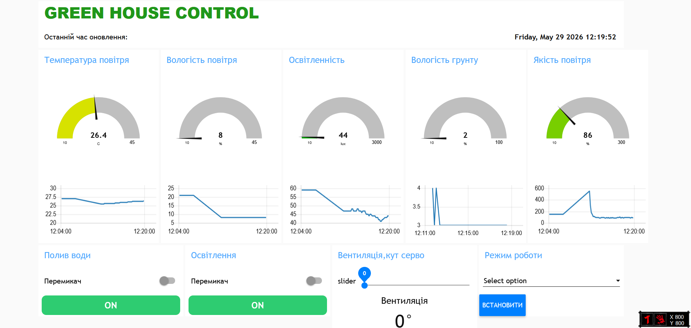
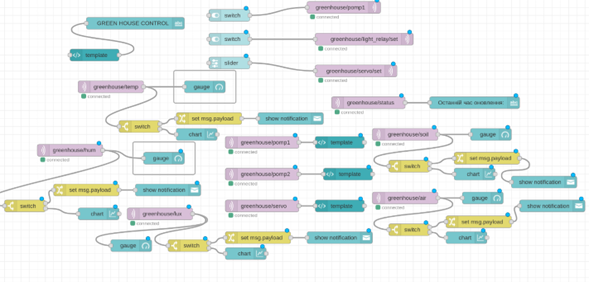
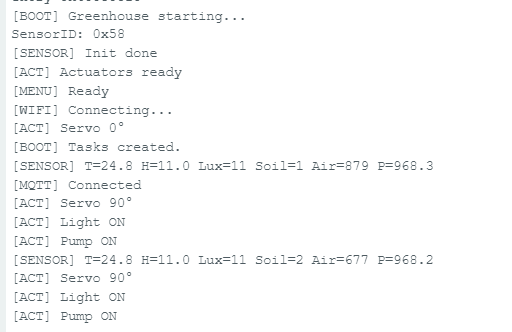
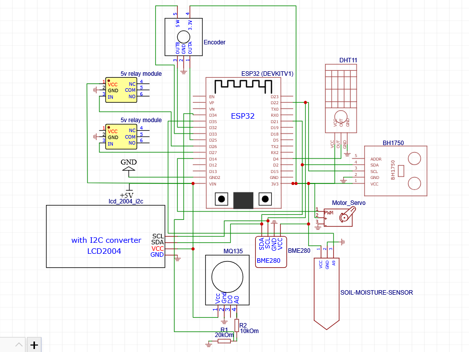
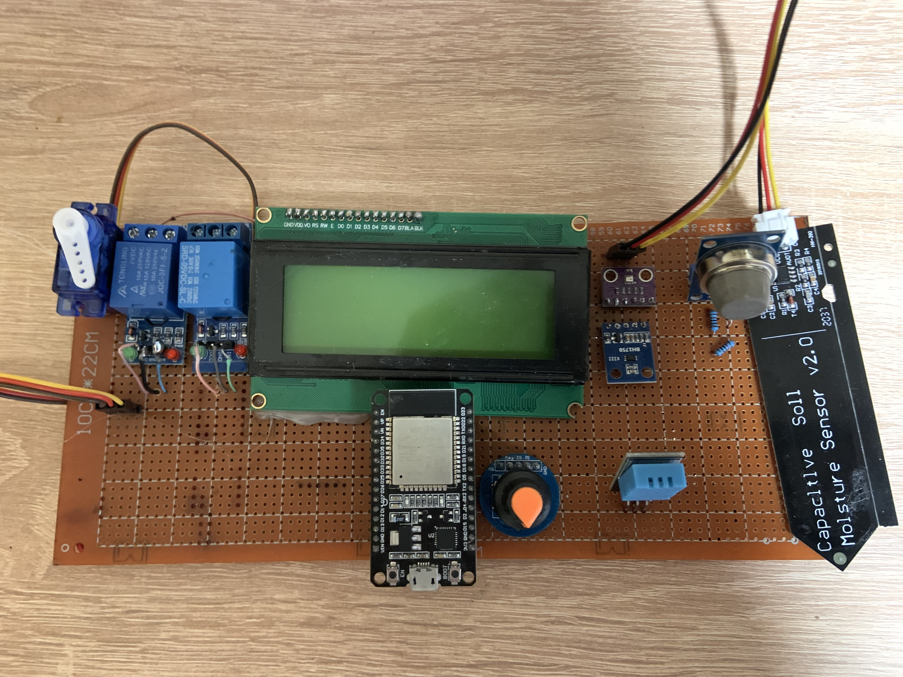

# 📘 Система керування мікроклімату в теплиці на базі мікроконтролера ESP32

> *Система для керування мікроклімату на ESP32 для підвищення урожайності використовуючи датчики та виконавчі механізми*

---

## 👤 Автор

- **ПІБ**: Заєць Володимир Олегович
- **Група**: ФЕС-41
- **Керівник**: Баран Микола, асистент,асистент кафедри радіофізики та комп'ютерних технологій. 
- **Дата виконання**: [01.05.2026]

---

## 📌 Загальна інформація

- **Тип проєкту**: Система керування (Апаратна частина + вебсайт)
- **Мова програмування**: С++ (Arduino)
- **Фреймворки / Бібліотеки**: Arduino, 

---

## 🧠 Опис функціоналу

- 💾 Отримання даних з датчиків
- 🌐 Автоматичний/ручний режим керування
- 🗒️ Вибір етапу вирощування
- 🔐 Зміна порогових значень з датчиків
- 📱 Інтерфейс з графіками даних з датчиків та  кнопками для керування виконавчими механізмами

---

## 🧱 Опис основних класів / файлів

| Клас / Файл     | Призначення |
|----------------|-------------|
| `greenhouse_control_esp32.ino`      | Точка входу ,основний файл для прошивки esp32|
| `config.h` | Константи, налаштування та параметри системи |
| `deps/` | Сторонні бібліотеки,потрібно скопіювати в папку Arduino |
| `node-red/flow_main.json`    | Файл проекту в Node-red |
| `sensors.h` | Оголошення функцій та структур для роботи із сенсорами |
| `sensors.cpp` | Зчитування даних із датчиків температури, вологості, освітленості та якості повітря |
| `actuators.h` | Оголошення функцій керування виконавчими пристроями |
| `actuators.cpp` | Керування вентилятором, освітленням, насосом та іншими виконавчими механізмами |
| `mqtt_manager.h` | Оголошення функцій MQTT-клієнта |
| `mqtt_manager.cpp` | Підключення до MQTT брокера, публікація та прийом повідомлень |
| `menu.h` | Оголошення функцій локального меню керування |
| `menu.cpp` | Реалізація інтерфейсу меню на LCD дисплеї |
| `state.h` | Опис структури стану системи |
| `state.cpp` | Зберігання та оновлення поточного стану теплиці |


---

## ▶️ Як запустити проєкт "з нуля"

### 1. Встановлення інструментів

- Arduino 2.3.8
- Node.js v24.0.16
- Node-red v4.1.8
- Mqtt broker mosquitto локально або HiveMq,EclipseMosquitto та ін.

### 2. Клонування репозиторію

```bash
git clone https://github.com/vovazaiets/greenhouse_control_esp32.git
cd greenhouse_control_esp32
```

### 3. Встановлення бібліотек

```bash
Потрібно скопіювати всі папки з /deps в папку Arduino (наприклад Документи/Arduino/libraries)
```

### 4. Запуск Node-red

#### 1 - Встановлення та запуск:
Завантажити node.js -> : https://nodejs.org/en/download

Відкрити командний рядок та встановити node-red:

```bash
npm install -g node-red
```
Перевірити встановлення Node-RED:
```bash
node-red --version
```
Запустити Node-RED командою:
```bash
node-red
```
Після цього node-red буде доступний за посиланням:
```bash
localhost:1880
```
**Після запуску потрібно налаштувати віджет mqtt (ip та порт)**
### 5. Встановлення брокера Mosquitto

Linux:
```bash
sudo apt update
sudo apt install mosquitto mosquitto-clients -y
```
Winbows:
```bash
Потрібно завантажити з офіційного сайту інсталятор https://mosquitto.org/download/
```
MQTT mosquitto локальний буде доступний на порі *1883* 
### 6. Завантаження прошивки в ESP32

1 - Відкрити основний файл greenhouse_control_esp32.ino в Arduino IDE

2 - Налаштувати всі основні параметри в файлі config.h

3 - Обрати плату ESP32 Dev_Module

4 - Натиснути кнопку Upload і дочекатись завантаження (в деяких випадках після компіляції потрібно затиснути кнопку boot на платі esp32)


---

## 🔌Перегляд передачі даних mqtt 

### 🔐 MQTT TOPICS 

| Topic name     | Призначення |
|----------------|-------------|
| `greenhouse/temp` | Температура |
| `greenhouse/hum` | Вологість повітря |
| `greenhouse/lux` | Освітленість |
| `greenhouse/soil` | Вологість ґрунту |
| `greenhouse/air` | Якість повітря |
| `greenhouse/pressure` | Атмосферний тиск |
| `greenhouse/light_relay` | Керування освітленням |
| `greenhouse/pomp_relay` | Керування насосом поливу |
| `greenhouse/servo` | Керування сервоприводом |
| `greenhouse/time` | Системний час |
| `greenhouse/mode` | Режим роботи системи |


Приклад перегляду даних температури:

```bash
mosquitto_sub -t "greenhouse/temp"
```

Приклад передачі даних в mqtt топік:

```bash
mosquitto_pub -t "greenhouse/temp" -m "23.5"
```
---


## 🖱️ Інструкція для користувача

1. **Головна сторінка Node-RED Dashboard** — відображення стану системи:
   - 📊 Показники з ESP32:
     - температура
     - вологість повітря
     - освітленість
     - вологість ґрунту
     - якість повітря
     - тиск
   - 🔗 Дані оновлюються в реальному часі через MQTT

---

2. **Керування системою**:
   - 💡 `Light Relay` — вмикання/вимикання освітлення
   - 💧 `Pump Relay` — керування поливом
   - ⚙️ `Servo` — керування кута сервопривода
   - 🔄 `Mode` — перемикання режиму роботи (AUTO / MANUAL)

---

3. **Node-RED інтерфейс**:
   - Доступ через браузер:
     ```
     http://localhost:1880
     ```
   - Dashboard для користувача:
     ```
     http://localhost:1880/ui
     ```
   - Всі елементи інтерфейсу редагуються через Node-RED flow editor

---

4. **Serial / ESP32 моніторинг (debug)**:
   - Підключення ESP32 через USB
   - Перегляд логів у Serial Monitor
   - Використовується для налагодження сенсорів та MQTT з'єднання

---

5. **Node-RED редагування системи**:
   - Додавання/зміна логіки через flow editor
   - Редагування MQTT topics:
     - `greenhouse/temp`
     - `greenhouse/hum`
     - `greenhouse/lux`
     - `greenhouse/soil`
     - `greenhouse/air`
   - Після змін обов’язково натиснути **Deploy**
## 📷 Приклади / скриншоти


- 📊 Node-RED Dashboard (головна панель моніторингу теплиці)  

  


- 🔁 Flow-редактор Node-RED (логіка обробки MQTT повідомлень)  

  


- 📡 Serial Monitor ESP32 (відлагодження та логування даних)  

  


---
## Схема підключення


---
## Загальний вигляд системи



---
## 🧪 Проблеми і рішення

| Проблема | Рішення |
|----------|--------|
| ESP32 не підключається до WiFi | Перевірити SSID та пароль, а також стабільність сигналу |
| MQTT не передає дані | Перевірити адресу брокера, порт та підключення ESP32 |
| Node-RED не отримує дані | Перевірити MQTT topics та чи запущений брокер |
| Дані не оновлюються в Dashboard | Натиснути Deploy у Node-RED та перевірити підписки |
| Serial Monitor пустий | Перевірити правильний COM-порт та швидкість baud rate (115200) |
| Реле не спрацьовує | Перевірити підключення GPIO та логіку керування |
| Неправильні значення сенсорів | Перевірити калібрування датчиків та живлення ESP32 |

---

## 🧾 Використані джерела / література

- ESP32 офіційна документація 
- MQTT протокол документація
- Node-RED офіційна документація 
- Node.js документація
- MQTT broker Mosquitto 
- ESP32 Arduino core 
- IoT architecture overview 
- StackOverflow
